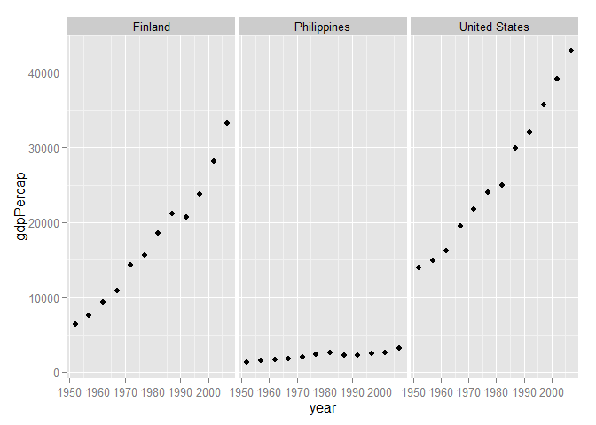

# Gapminder
Teena  
July 7, 2015  


```
## 
## Attaching package: 'dplyr'
## 
## The following objects are masked from 'package:stats':
## 
##     filter, lag
## 
## The following objects are masked from 'package:base':
## 
##     intersect, setdiff, setequal, union
```


```r
df1 <- filter(df, country == "Finland"| country == "Philippines"|country == "United States")
```


```r
ggplot(data=df1, aes(x=year, y=gdpPercap)) +
  geom_point() +
  facet_wrap(~country)
```

 

The mean per capital GDP in the data set is
7215.33
